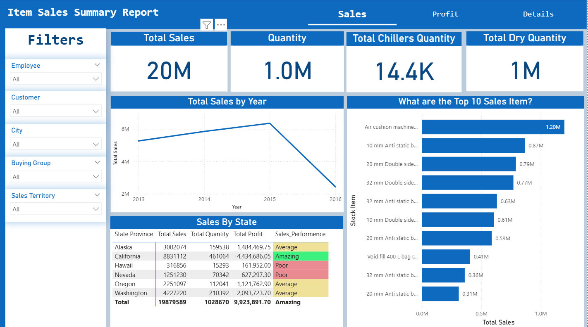

# ALSIDDIG AMASAIB

## Contact Information

- **Full name :** Alsiddig Abdelrahman Alsiddig Amasaib
- **Mobile Number:** +966 550 1788 90
- **Email:** alsiddigamasaib@gmail.com
- **Alternatve Email:** siddigalssadig@gmail.com
- **linkedIn**: https://www.linkedin.com/in/al-siddig-amasaib-668a66117

## PROFESSIONAL SUMMARY

**Data analyst** with hands-on experience in **Power BI, Excel, and Python** specializing in data visualization, KPI reporting, and business insights. Strong background in technical support and operations analysis, with proven ability to transform raw data into actionable insights that support decision-making. Experienced in building end-to-end analytics projects, including interactive dashboards and SQL-driven analysis, **supported by LinkedIn Learning certifications in Data Analytics foundations and MySQL Development**. Actively seeking **Data Analyst | BI Analyst opportunities.**

## TECHNICAL SKILLS

- **📊Data Analysis & Visualization**: Power BI (DAX, Drill-through), Excel (Advanced formulas, Pivot Tables, Power Query), KPI Reporting
- **💾Database & Querying:** SQL (Joins, CTEs, Subqueries, Window Function), Data Extraction & Analysis
- **🕵️‍♀️Programming:** Python (Pandas, NumPy – Beginner)
- **Analytics Techniques:** Data Cleaning & Preparations, Trends & Performance Analysis, Business & HR Analytics
- **🛠️Tools:** Git, GitHub, VS Code

## PROJECTS

- **HR Analytics Dashboard | Power BI**

  - Built an interactive HR dashboard analyzing **employee attrition satisfaction, performance, and salary trends**.
  - Designed a** multi-page report** (Overview, Assessment, Details) with KPIs and drill-through functionality.
  - Created DAX measures for attrition rate, average tenure, and salary insights
  - Identified high-risk departments and roles to support data-driven HR decision-making

  
  [_Feel Free to see the full dashboard in Power BI Service_](https://app.powerbi.com/groups/me/reports/ee2c755a-a01e-4c33-baa4-6c8aeeef520a/21fe873d87d422aac2f0?experience=power-bi)

- **Business & Sales Data Analysis | SQL & Power BI**

  - Analyzed transactional sales data using **SQL joins, CTEs, and window functions**.
  - Identified top customer, revenue trends, and performance insights.
  - Visualized findings using Power BI dashboard for management-level reporting.

[_Feel Free to see the full dashboard in Power BI Service_](https://app.powerbi.com/groups/me/reports/3338abf6-7f5f-42c2-a2da-2704f6c47e06/2c158746ca1beb3bb626?experience=power-bi)

- **SQL Data Analysis Portfolio**

  - Solved real-world analytical problems using advanced SQL queries.
  - Performed customer segmentation, ranking analysis, and trend analysis.
  - Published queries and documentation on GitHub as part of a data analytics portfolio.

  

  _Bar graph visualizing the salary fir the top 10 salaries for data analysts, ChatGPT gererated this graph from my SQL query results_

## PROFESSIONAL EXPERIENCE

### Technical Support Specialist

**IPS Logistics Services** | Riyadh • Full-time • 01/2024 – Present

- Analysed support tickets and incident data to identify recurring issues and performance bottlenecks.
- Created **Excel and Power BI reports** to track KPIs, system uptime, and customer complaints.
- Designed mini dashboards to visualize operational trends and improve response efficiency.
- Collaborated with cross-functional teams to implement p**rocess improvements based on data insights.**
- Documented technical processes and created visual summaries to support reporting and decision-making.

---

### Mail room Clerk

**SAB Bank** | Riyadh • Full-time • 07/2019 – 01/2024

- Managed and tracked internal mail operations for 2000+ employees, ensuring compliance with security and data-handling policies.
- Streamlined mail processing workflows, reducing delivery time and improving operational efficiency.
- Maintained accurate records using internal tracking system, supporting performance monitoring and reporting.

---

### Technical Support Engineer

**Sudan Sport TV** | Khartoum, Sudan • Part-time • 10/2017 - 06/2019

- Monitored and maintained IT systems and inventory data.
- Implemented a tracking process that reduced lost or damaged equipment.

---

### IT system administrator

**AL HOST for Integrated Solution Co. Ltd** | Khartoum, Sudan • Full-time • 01/2018 - 06/2019

- Managed and maintained 15+ hosted websites, ensuring high system availability
- Performed data backups, system monitoring, and performance optimization

## EDUCATION

**Bachelor’s Degree in Computer Science**

International University of Africa • Khartoum, Sudan • GPA: Good • 07/2012 - 10/2017

## CERTIFICATIONS

- **Learning Data Analytics: 1 Foundations** – LinkedIn Learning •
  [View Certificate](https://www.linkedin.com/in/al-siddig-amasaib-668a66117/overlay/1764680909171/single-media-viewer/?profileId=ACoAAB0qujABgIYFXyJYMFrw0BX8dAxXVfJtSn4)
- **Learning MySQL Development** – LinkedIn Learning •
  [View Certificate](https://www.linkedin.com/in/al-siddig-amasaib-668a66117/overlay/1764681338107/single-media-viewer/?profileId=ACoAAB0qujABgIYFXyJYMFrw0BX8dAxXVfJtSn4)
- **CCNA** – KYM Technology Center
- **CCTV** – KYM Technology Center
